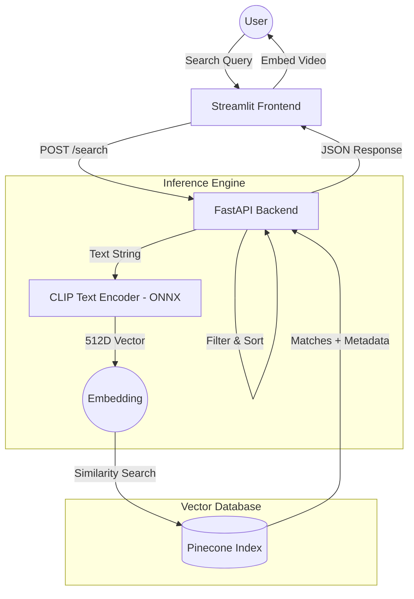
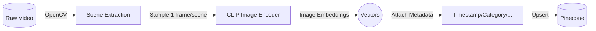
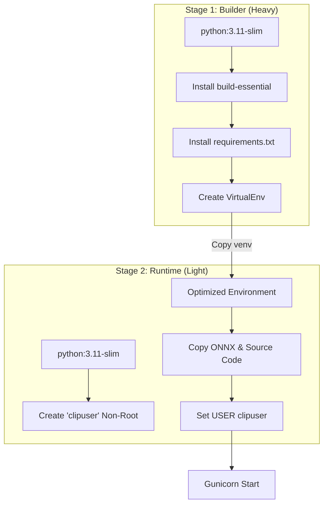

# ClipStream Technical Documentation 🛠️
This document outlines the internal workflows, data structures, and build processes for the ClipStream semantic search engine.

## 1. System Pipelines

### A. Search Pipeline (Live)

This flow describes how a user query is transformed into a timestamped video result.

### B. Ingestion Pipeline (Offline/Batch)

This describes how raw video files are processed to populate the Pinecone index.

## 2. Pinecone Metadata Schema

ClipStream relies on structured metadata attached to each vector to enable filtering and precise video seeking.

|   **Field**   | **Type** |                      **Description**                     |         **Example**         |
|:-------------:|:--------:|:--------------------------------------------------------:|:---------------------------:|
| video_name    | string   | The title or identifier of the source video.             | "attack_on_titan_s1"        |
| start_time    | float    | The exact timestamp (in seconds) where the match begins. | 124.5                       |
| end_time      | float    | The exact timestamp (in seconds) where the match ends.   | 130.5                       |
| category      | string   | Used for multi-select filtering in the UI.               | "anime", "amv"              |
| year          | integer  | Allows for temporal filtering of content.                | 2024                        |
| thumbnail_url | string   | URL to the representative frame for the search result.   | https://img.youtube.com/... |

Filtering Logic: The backend constructs a Pinecone filter using the $in operator for category and year to ensure sub-millisecond retrieval of context-aware results.

## 3. Multi-Stage Docker Build Process

To minimize the production footprint and enhance security, ClipStream utilizes a two-stage build.

**Build Advantages**

1. **Size Reduction**: The final image excludes gcc and build tools, saving ~300MB.

2. **Security**: By using USER clipuser, even if the FastAPI app is compromised, the attacker has no root privileges within the container.

3. **Reproducibility**: The virtual environment is locked during Stage 1, ensuring no dependency drift in production.
